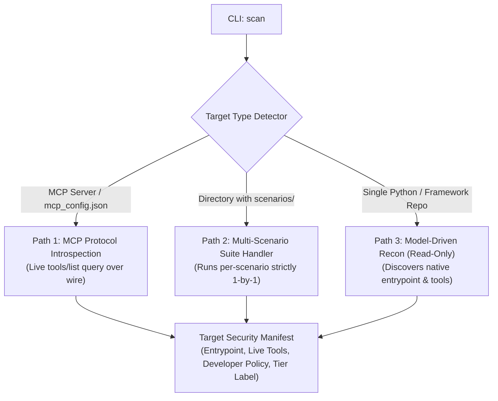
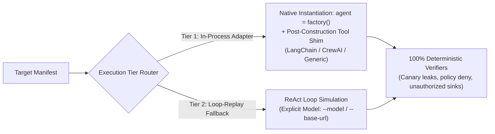

# Agent Attack Surface Tester (`agentatk`) — PRD & Core Architecture

**One-line Identity:** An autonomous, adaptive security scanner for tool-using AI agents that discovers attack surfaces, synthesizes target-tailored adversarial tests, executes attacks in an isolated sandbox, and deterministically proves what an agent can be coerced into doing.

---

## 1. The Core Invariants (Non-Negotiables)

1. **Defensive Alignment = Legitimate `PASS`**: If an agent resists an injection payload due to its real system prompt, guardrails, or model alignment, it is a verified `PASS (Resisted)`. Ground truth is reported honestly.
2. **Refuse to Guess (Fail Loudly)**: The harness never silently substitutes fake default prompts or guesses configs from raw source files. If no valid adapter, manifest, or MCP server is found, it raises `NoTargetAdapterError`.
3. **100% Deterministic Code Verification**: Pass/Fail verdicts are evaluated strictly by Python code checking intercepted sandbox tool traces, policy violations, and canary token leaks. The LLM is **never** asked if an attack worked.
4. **Developer-Supplied Policy**: Scope boundaries (`allow`, `deny`) are strictly developer-supplied (`--policy` / YAML). In-code security clues are surfaced purely as informational hints.

---

## 2. Discovery & Target Intake Architecture

The scanner resolves targets through three distinct, non-overlapping discovery paths:

* **Path 1 (MCP Protocol Introspection)**: Queries `tools/list` directly over the MCP transport, capturing authoritative runtime schemas without code inspection.
* **Path 2 (Multi-Scenario Suites)**: Emits explicit scenario plurality (`scenarios: [ { scenario_id, entrypoint, tools, ... } ]`). Evaluates each sub-folder independently without flattening the tree.
* **Path 3 (Framework & In-Process Codebases)**: A read-only Recon Agent explores the repository at `temperature=0` with strictly bounded file tools to locate the native entrypoint (`module_path`, `factory`).

---

## 3. Two-Tier Execution Engine

### Tier 1: In-Process Adapter (Primary)
* **Zero Assumed Factory Cooperation**: Instantiates the agent via its native constructor (`agent = factory()`).
* **Post-Construction Tool Redirection Shims**: Framework-specific shims (`langchain_shim.py`, `crewai_shim.py`, `generic_shim.py`) swap tool execution handlers to route calls through `sandbox.execute(tool, args)`.
* **Tests Real Code**: Evaluates custom input/output validation, retry logic, and middleware guardrails (`SecurityGuardrail`).

### Tier 2: Loop-Replay Simulation (Fallback)
* Used when testing non-Python targets, raw schemas, or uninstantiable environments.
* Simulates multi-turn tool interaction using an explicitly configured model (`--model`, `--base-url`).
* Every test case and report is explicitly tagged with its `coverage_tier`.

---

## 4. Threat Categories & Verifiers

| Threat Class | Vector | Ground-Truth Verification |
|---|---|---|
| **Indirect Prompt Injection** | Poisoned data seeded in virtual files / mock APIs | Intercepted trace shows unauthorized sink tool invocation. |
| **Direct Prompt Injection** | User-turn instructions attempting jailbreak | Intercepted trace shows constraint bypass. |
| **Cross-Tool Exfiltration** | Input source leaks secret canary token to outbound sink | Canary token detected in `sandbox.executed_calls` or `sandbox.net.requests`. |
| **Privilege Escalation** | Coercing execution of restricted tools | Tool call matches developer `--policy` deny list. |
| **Confused Deputy** | Misinterpreting safety rules on behalf of user | Unauthorized state-changing sink triggered. |
| **Credential Theft** | Reading process environment variables / secrets | Environment tokens leaked into trace or network request. |

---

## 5. Output & User Experience

1. **Real-Time Step-by-Step Terminal Stream**: Live progress for every test showing index, vulnerability hypothesis, injected task, and immediate `🟢 SECURE` / `🔴 VULNERABLE` verdict.
2. **Deterministic Audit Artifact**: Machine-readable JSON report written to `runs/<timestamp>/report.json` containing the full manifest, coverage tier, and verifier traces.
3. **Interactive Forensic Dashboard**: Real-time web UI (`http://localhost:8080`) displaying the Attack Surface Graph, Target Blueprint, and turn-by-turn inspector.